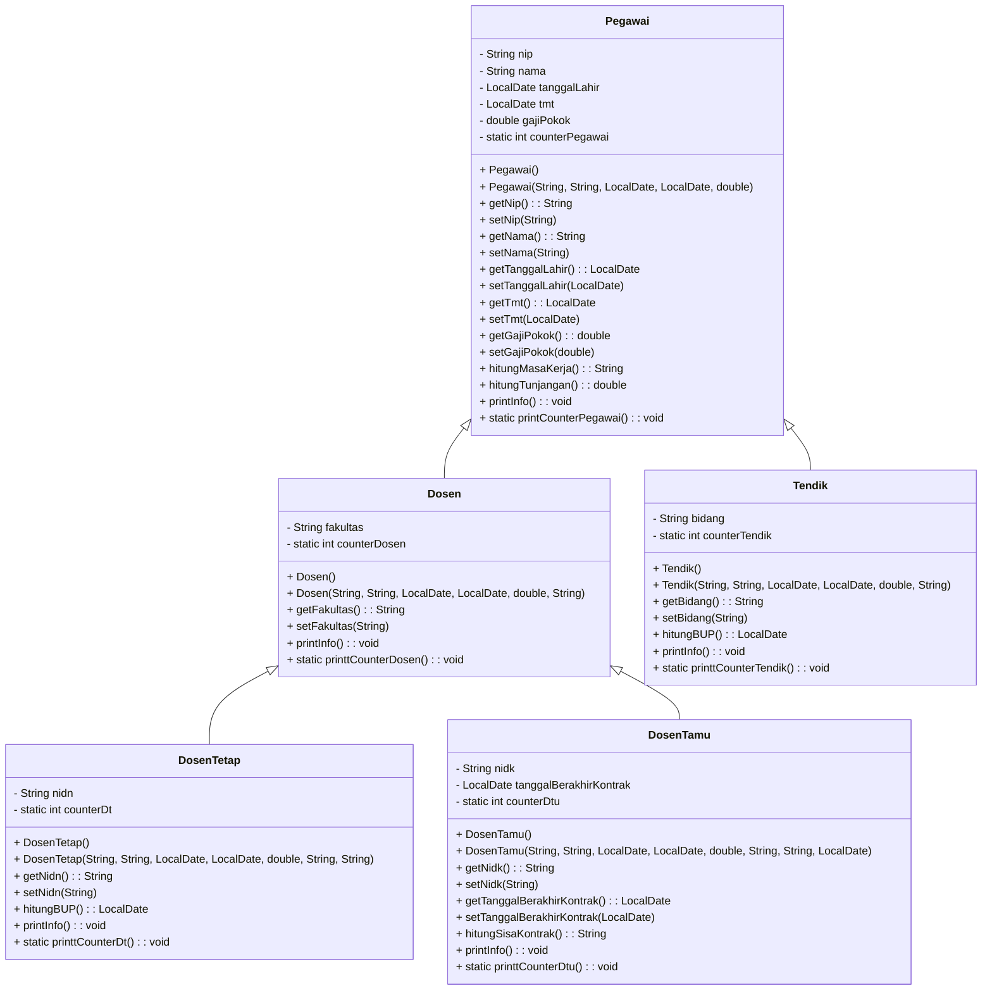

```mermaid
classDiagram
    class Pegawai {
        - String nip
        - String nama
        - LocalDate tanggalLahir
        - LocalDate tmt
        - double gajiPokok
        - static int counterPegawai
        + Pegawai()
        + Pegawai(String, String, LocalDate, LocalDate, double)
        + getNip(): String
        + setNip(String)
        + getNama(): String
        + setNama(String)
        + getTanggalLahir(): LocalDate
        + setTanggalLahir(LocalDate)
        + getTmt(): LocalDate
        + setTmt(LocalDate)
        + getGajiPokok(): double
        + setGajiPokok(double)
        + hitungMasaKerja(): String
        + hitungTunjangan(): double
        + printInfo(): void
        + static printCounterPegawai(): void
    }

    class Dosen {
        - String fakultas
        - static int counterDosen
        + Dosen()
        + Dosen(String, String, LocalDate, LocalDate, double, String)
        + getFakultas(): String
        + setFakultas(String)
        + printInfo(): void
        + static printtCounterDosen(): void
    }

    class DosenTetap {
        - String nidn
        - static int counterDt
        + DosenTetap()
        + DosenTetap(String, String, LocalDate, LocalDate, double, String, String)
        + getNidn(): String
        + setNidn(String)
        + hitungBUP(): LocalDate
        + printInfo(): void
        + static printtCounterDt(): void
    }

    class DosenTamu {
        - String nidk
        - LocalDate tanggalBerakhirKontrak
        - static int counterDtu
        + DosenTamu()
        + DosenTamu(String, String, LocalDate, LocalDate, double, String, String, LocalDate)
        + getNidk(): String
        + setNidk(String)
        + getTanggalBerakhirKontrak(): LocalDate
        + setTanggalBerakhirKontrak(LocalDate)
        + hitungSisaKontrak(): String
        + printInfo(): void
        + static printtCounterDtu(): void
    }

    class Tendik {
        - String bidang
        - static int counterTendik
        + Tendik()
        + Tendik(String, String, LocalDate, LocalDate, double, String)
        + getBidang(): String
        + setBidang(String)
        + hitungBUP(): LocalDate
        + printInfo(): void
        + static printtCounterTendik(): void
    }

    Pegawai <|-- Dosen
    Pegawai <|-- Tendik
    Dosen <|-- DosenTetap
    Dosen <|-- DosenTamu
```